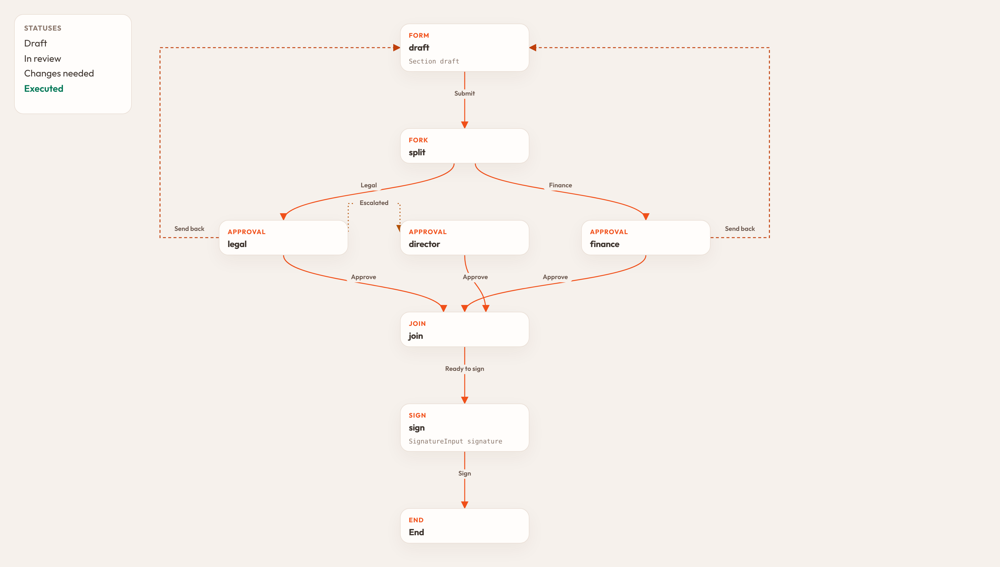
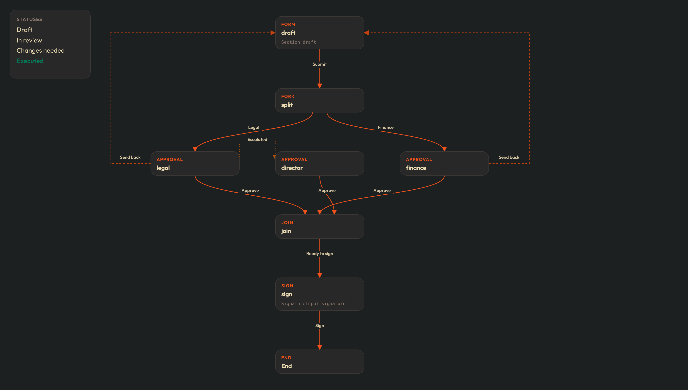
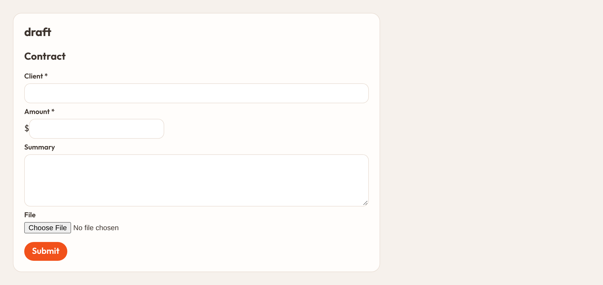
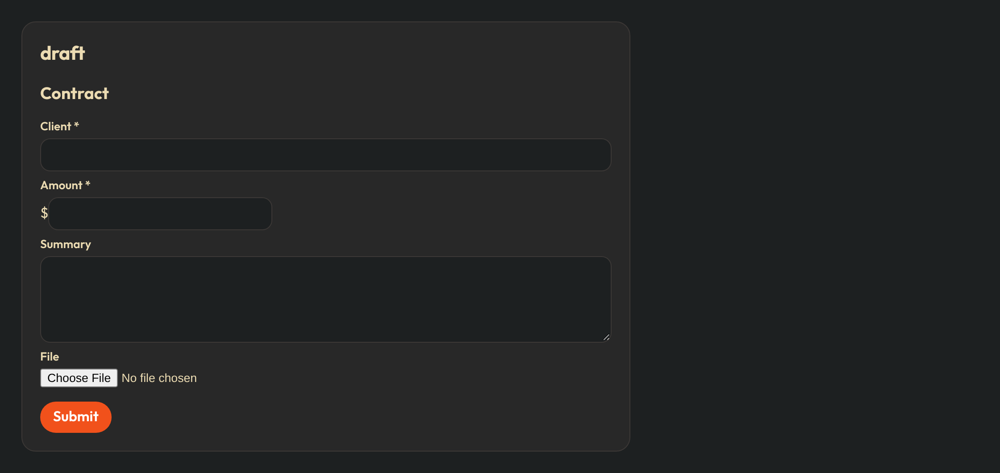
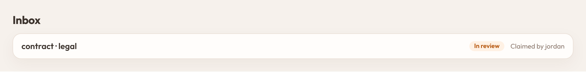
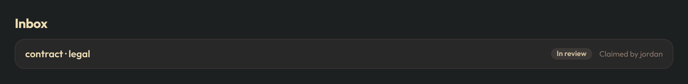
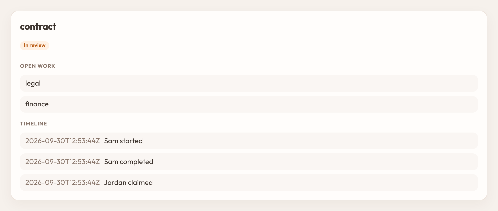
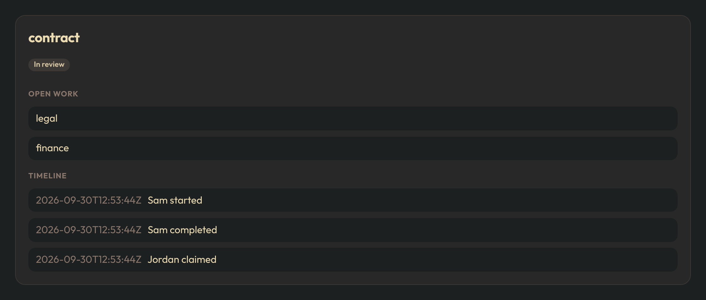

# almasix-orbit-workflows

<p align="center">
  <a href="https://pypi.org/project/almasix-orbit-workflows/"></a>
  <a href="https://github.com/almasix-dev/almasix-orbit-workflows/actions/workflows/ci.yml"></a>
  <a href="https://github.com/almasix-dev/almasix-orbit-workflows/tree/main/tests"></a>
  <a href="https://pypi.org/project/almasix-orbit/"></a>
  <a href="https://github.com/almasix-dev/almasix-orbit-workflows/blob/main/LICENSE"></a>
</p>

Versioned workflows for [Orbit](https://orbit.almasix.com/) panels. A **published document** is the contract: the statuses, the steps, who must act, and the form on each step. A **case** follows one version of that document until it finishes. Editing the document later does not move a case that has already started.

Register the plugin on a panel. Orbit never auto-discovers plugins.

## Install

```bash
pip install almasix-orbit-workflows
```

```python
from almasix.orbit import Panel, PanelRegistry
from almasix_orbit_workflows import Directory, WorkflowEngine, WorkflowPlugin

def register_admin_panel(registry: PanelRegistry) -> Panel:
    engine = WorkflowEngine(directory=Directory([
        {"id": "sam", "name": "Sam", "roles": ["sales"], "manager_id": "jordan"},
        {"id": "jordan", "name": "Jordan", "roles": ["legal"]},
        {"id": "ava", "name": "Ava", "roles": ["finance"]},
    ]))
    panel = (
        Panel.make("admin")
        .path("admin")
        .plugin(WorkflowPlugin.make(engine))
    )
    registry.register(panel)
    return panel
```

The plugin adds three pages under **Workflows**:

- **Inbox** — open tasks for the signed-in person
- **Cases** — the timeline, open tokens, and signatures for one case
- **Designer** — the document as a canvas of steps and edges

## Visual design

The canvas is the document: statuses on the side, each step a card, and an arrow for every transition.





The draft step is an Orbit form. Submit is the edge label.





The inbox shows the document's status color. Claiming a role task puts your name on the row.





A case keeps the timeline and only the tokens still open.





`Directory` is your panel's users and roles. Each record needs `id`. Optional fields are `name`, `roles` (a list of role names), and `manager_id`.

## A contract, from draft to signature

Statuses belong to this document. Another workflow can use different words.

```python
from almasix_orbit_workflows import Person, Step, Workflow, role, starter

contract = (
    Workflow.make("contract")
    .titled("Contract")
    .zone("Africa/Nairobi")
    .status("draft", "Draft")
    .status("review", "In review", color="warning")
    .status("changes", "Changes needed", color="danger")
    .status("executed", "Executed", color="success", terminal=True)
    .step(
        Step.make("draft", "form")
        .assignee(starter())
        .schema([
            {
                "type": "Section",
                "name": "details",
                "heading": "Contract",
                "schema": [
                    {"type": "TextInput", "name": "client", "label": "Client", "required": True},
                    {"type": "MoneyInput", "name": "amount", "label": "Amount", "required": True},
                    {
                        "type": "Grid",
                        "name": "split",
                        "columns": 2,
                        "schema": [
                            {"type": "Textarea", "name": "summary", "label": "Summary"},
                            {"type": "FileUpload", "name": "pdf", "label": "File"},
                        ],
                    },
                ],
            },
        ])
        .on("submit", to="legal", status="review", label="Submit")
    )
    .step(
        Step.make("legal", "approval")
        .assignee(role("legal"))
        .remind("1d")
        .escalate(after="2d", to="director", status="review", label="Escalated")
        .on("approve", to="end", status="executed", label="Approve")
        .on("return", to="draft", status="changes", label="Send back")
    )
    .step(
        Step.make("director", "approval")
        .assignee(role("director"))
        .on("approve", to="end", status="executed", label="Approve")
    )
)

engine.save(contract.document())
engine.publish("contract")
```

`publish` checks the graph. Every edge must name a status that exists on the document. An edge that ends the case must use a status marked `terminal=True`. A route needs a default edge with no condition. A step that cannot be reached from the start is rejected.

```python
case = engine.start(
    "contract",
    Person.of("sam", "Sam"),
    subject_type="Contract",
    subject_id="42",
)
task = next(t for t in engine.store.tasks_for(case["id"]) if t["state"] == "open")
case = engine.complete(task["id"], Person.of("sam", "Sam"), "submit", {
    "client": "Acme",
    "amount": "12000",
})
```

`subject_type` and `subject_id` point at your own record. The workflow stores the answers and the status key. Your module keeps the books.

## Steps

| Kind | What happens |
| --- | --- |
| `form` | Someone fills the step's schema. |
| `approval` | Someone chooses a named outcome. Buttons use the edge labels. |
| `sign` | Same as an approval, and the signing outcomes require a signature. |
| `route` | No task. The first matching condition wins. |
| `notify` | Sends a notice and follows its one edge. |
| `fork` | Opens every outgoing branch at once. |
| `join` | Waits until incoming branches meet `all`, `any`, or a quorum, then follows its edge. |

An edge's `branch` is `finish` or `abort`.

- **finish** completes that branch and leaves the others running. Use this when IT, finance, and facilities must each clear a staff exit even if one of them records an outstanding item.
- **abort** cancels the other open tasks in the fork. Use this when one reviewer sends a contract back to draft.

```python
Step.make("legal", "approval").assignee(role("legal")).on(
    "return", to="draft", status="changes", label="Send back", branch="abort",
)
```

## Who must act

Call `.assignee()` once for each rule. A step may combine them. The people are resolved when the task opens, and stored on the task, so a later role change does not rewrite a task already in someone's inbox.

| Helper | Assigns |
| --- | --- |
| `user("jordan")` | That person. |
| `role("legal")` | Anyone who holds the role. |
| `starter()` | The person who opened the case. |
| `field("manager")` | The user id saved in an earlier answer named `manager`. |
| `expression("manager_of:starter")` | The starter's `manager_id`. |
| `expression("role_except_starter:legal")` | The role, excluding the starter. |
| `guest("ada@example.com", "Ada")` | A person with no panel account. They receive a link that opens this step only. The link stops working when the task is finished or reassigned. |

```python
Step.make("offer", "sign").assignee(guest("ada@example.com", "Ada")).signs("sign").on(
    "sign", to="end", status="hired", label="Sign",
)
```

When several people qualify, `.how_many()` decides how the step finishes:

- `any` (the default) — one shared task. The first person to claim it holds it. Anyone else in the pool sees who claimed it. One completion moves the case.
- `all` — one task per person. Everyone must choose the same outcome.
- `quorum` — one task per person. The step moves when that many agree.

If a rule matches nobody, the task stays open and **unassigned**. Someone who can reassign gives it a person:

```python
engine.reassign(task_id, actor, "jordan")
```

## Forms

A step schema is an Orbit form, stored as a tree of components. Layouts nest. Every Orbit input is allowed, including `Repeater`, `FileUpload`, relationship selects, and `SignatureInput`.

`visible_when` reads answers already on the case:

```python
{"type": "Textarea", "name": "note", "label": "Note", "required": True, "visible_when": 'answers.kind=="extra"'}
```

Route conditions use the same shape, plus named effects:

```python
.on("high", to="finance", status="review", label="Finance", when="answers.amount>=1000")
.on("open", to="end", status="waitlisted", label="Waitlist", when="effect:seats_remaining")
.on("else", to="end", status="registered", label="Register")
```

`engine.save_draft(task_id, actor, payload)` stores answers before submit. Submit is `engine.complete`.

## Effects

Register a function under a name. An edge calls it after validation and before the case moves. Raise `Refused` to leave the task open and show the message. Use this for a budget check, a seat reservation, or a journal posting. The ledger itself stays in your module.

```python
from almasix_orbit_workflows.errors import Refused

def post_journal(answers, context):
    if float(answers["amount"]) > 10000:
        raise Refused("Over the approval limit.")

engine.effects["post_journal"] = post_journal
```

```python
.on("submit", to="legal", status="review", label="Submit", effect="post_journal")
```

The call receives an `idempotency_key`. A repeated completion of the same task does not call the effect twice.

An edge can also start another published workflow with the same subject:

```python
.on("sign", to="end", status="hired", label="Sign", start_workflow="onboarding")
```

## Signatures

Outcomes listed in `.signs()` require a drawn or typed signature and the signer's name. The engine stores the image, the name, the statement of intent from `.statement()`, and a hash of the answers plus any file hashes you pass. Later edits to the subject record do not rewrite that snapshot.

```python
engine.complete(
    task_id,
    actor,
    "sign",
    {"signature": "data:image/png;base64,...", "signer_name": "Sam"},
    files={"pdf": file_hash},
)
```

`file_hash` is a sha256 hex digest of the file bytes. Import `file_hash` from `almasix_orbit_workflows.signing` or pass a digest you already computed.

## Time

`.zone()` is the timezone used for day-long durations. `.escalate(after="2d", to=..., status=..., label=...)` follows that edge when the deadline passes and sets the status you named. `.remind("1d")` notifies the assignees before the deadline and does not change status.

Call `engine.promote_due()` from a scheduler. Opening the inbox runs the same check, so a waiting person still sees an escalated task if the schedule has not run.

`.limit_visits(8, stuck_status="changes")` stops a send-back loop. After that many entries into one step, the case moves to `stuck_status` when you set one.

## Case actions

Withdraw and operator moves are edges on the document, so their statuses are not hard-coded:

```python
Workflow.make("contract")
    .case_action("withdraw", status="changes", label="Withdraw", who="starter")
    .case_action("move", status="draft", label="Return to draft", who="role:operate")
```

`who` is `starter`, `operate` (the person must hold the `operate` role), or `role:<name>`.

```python
engine.take_case_action(case_id, actor, "withdraw")
```

Open tasks are cancelled. If the status is terminal, the case closes. The timeline records the action.

`engine.comment(case_id, actor, "Holding for legal.")` appends a note to that timeline.

## Run a document before you publish it

`simulate` walks a private copy of the engine. Nothing is written to the live store.

```python
engine.simulate(
    contract.document(),
    [
        {"action": "start"},
        {"action": "complete", "outcome": "submit", "payload": {"client": "Acme", "amount": "12000"}},
    ],
    actor=Person.of("sam", "Sam"),
)
```

`engine.retire("contract")` keeps open cases on their version and refuses new starts.

## Develop

```bash
pip install -e '.[dev]'
pytest --cov=almasix_orbit_workflows --cov-fail-under=100
```

Marketplace listing: [orbit.almasix.com/plugins/orbit-workflows](https://orbit.almasix.com/plugins/orbit-workflows/).
